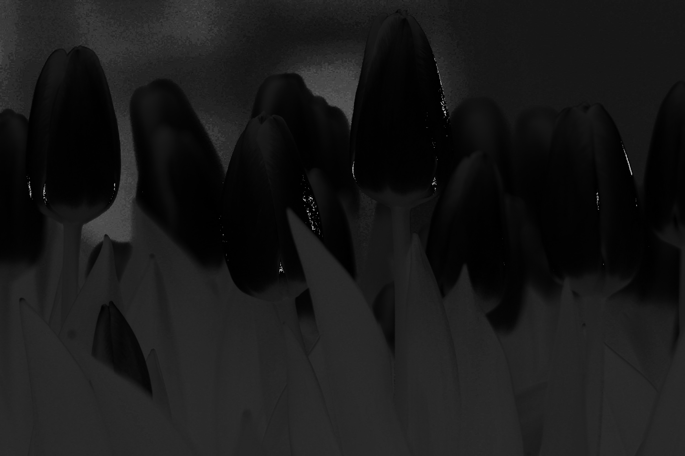
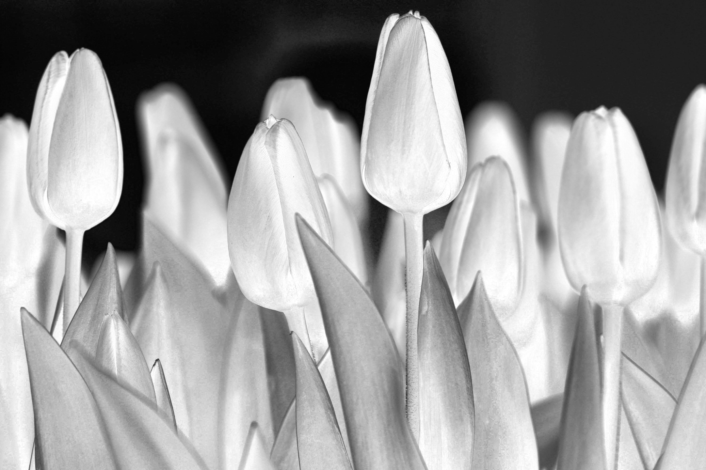
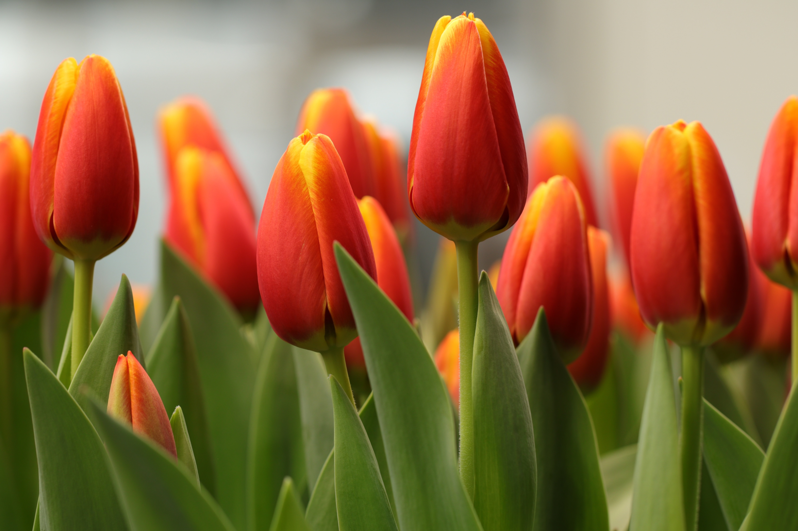
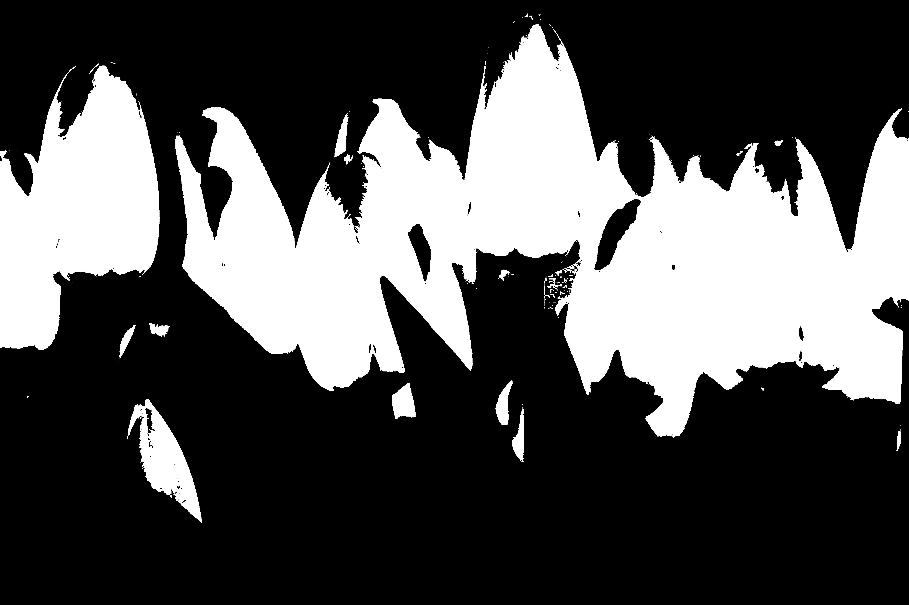
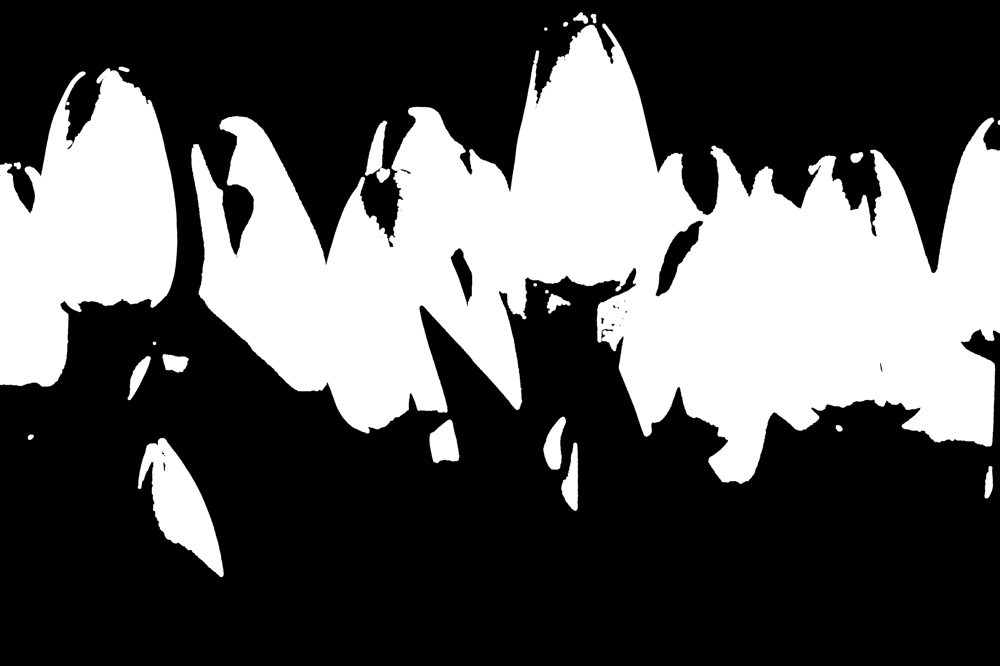
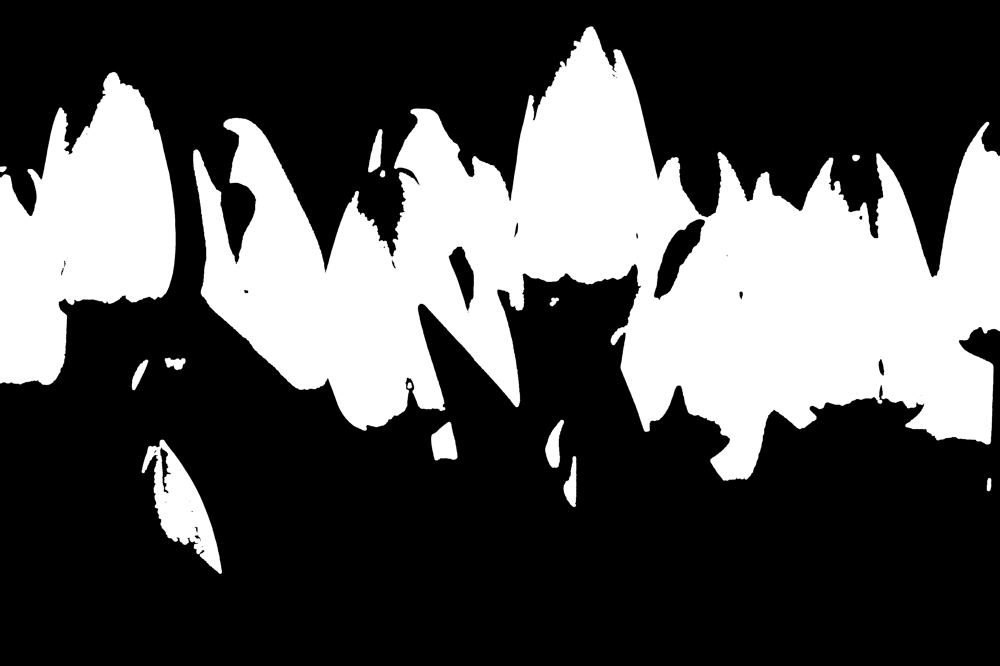
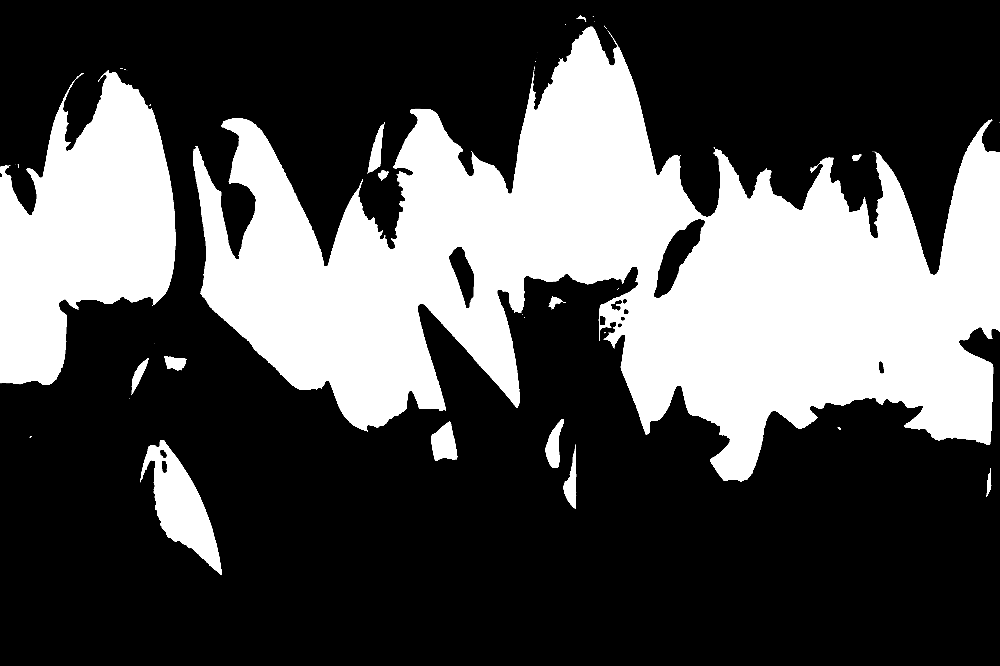
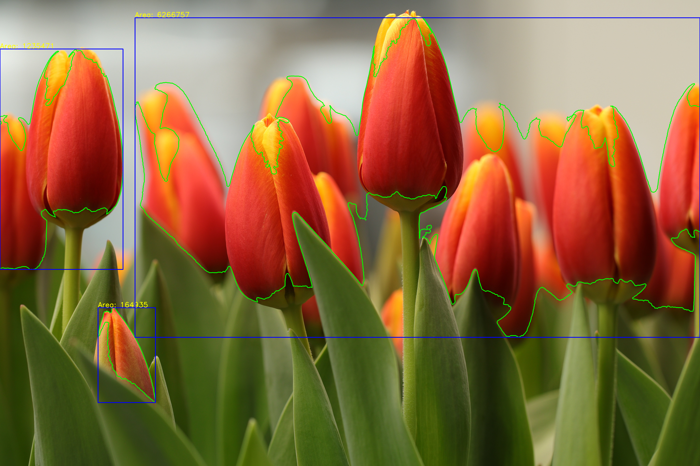

# RoboMaster 算法组第二次培训

三个任务统一在同一工程，使用 **C++ + OpenCV + CMake** 完成；矩阵计算用 **Eigen**，
任务 2 的参数拟合采用「Ω 网格搜索 + 线性最小二乘」

---

## 1. 环境依赖

| 依赖 | 版本 | 用途 |
|---|---|---|
| CMake | ≥ 3.16（实际 3.22） | 构建 |
| g++ | C++17（实际 11.4） | 编译 |
| OpenCV | 4.10.0 | 图像 / 视频处理 |
| Eigen3 | 3.4.0 | 矩阵运算、最小二乘 |
| Python3 + numpy + matplotlib | 3.10 / 1.26 / 3.5 | 任务 2 出图 |


## 2. 构建与运行命令

```bash
cmake -S . -B build
cmake --build build -j4

./build/task1              # 任务1：图片处理（生成 16 张图）
./build/task2              # 任务2：视频拟合（生成标注视频 + CSV）
python3 scripts/plot.py    # 任务2：由 CSV 出 3 张曲线图
./build/task3              # 任务3：能量机关识别跟踪（YOLO ONNX + 角速度预测跟踪）
```

## 3. 输入输出路径

**输入（`resources/`）**

| 文件 | 用途 |
|---|---|
| `test_image.jpg` | 任务 1 郁金香图（Pixabay，6000×4000） |
| `task_2.mp4` | 任务 2 合成旋转视频（960×720，60 FPS，1440 帧） |
| `task_3.mp4` / `task_4.mp4` | 任务 3 真实能量机关视频 |

**输出（`result/`）**

| 目录 / 文件 | 内容 |
|---|---|
| `task1_images/` | 任务 1 的 16 张处理图 |
| `task2_fit/` | 标注视频 + 3 张曲线图 + CSV |
| `task2_fit_result.md` | 任务 2 模型 / 参数 / 方法 / 误差说明 |
| `task3_windmill/` | 任务 3 结果（识别视频） |

## 4. 关键参数

### 任务 1

| 参数 | 值 |
|---|---|
| 滤波核尺寸 | 均值 5×5；高斯 5×5（σ=1.5）；中值 5 |
| 红色 HSV 阈值 | H ∈ [0,10] ∪ [170,179]；S ∈ [43,255]；V ∈ [46,255] |
| 形态学核 | 20×20 椭圆（腐蚀 / 膨胀 / 开 / 闭共用） |
| 轮廓面积阈值 | 90000 px² |

### 任务 2

| 参数 | 估计值 | 单位 |
|---|---|---|
| A（振幅） | 0.550 | rad/s |
| b（平均角速度） | 1.350 | rad/s |
| Ω（频率参数） | 1.65 | rad/s |
| φ（相位） | 0.701 | rad |
| RMSE（角速度） | 0.0311 | rad/s |

---

## 5. 任务 1 分析（郁金香图片处理）

### ① 读图与颜色转换

读图检查成功；输出灰度图，以及 HSV 三通道单通道图（H / S / V）。灰度图作为后续
阈值分割与梯度计算的输入；HSV 用于颜色分割。

**灰度图**


**H 通道**



**S 通道**



**V 通道**


### ② 滤波对比（核 5×5，高斯 σ=1.5）

- **均值滤波**：邻域取平均，平滑最均匀，但花瓣边缘一并被模糊。
- **高斯滤波**：按高斯权重平均，中心权重高，边缘细节保留优于均值。
- **中值滤波**：取邻域中位数，对椒盐噪声效果好，同时保留一定边缘。

**均值滤波**



**高斯滤波**


**中值滤波**


### ③ 红色提取（HSV 双区间）

红色在色相环上跨越 H 两端，用两段区间取并集：`[0,10]` ∪ `[170,179]`。
S、V 下限取 43 / 46，以覆盖饱和度、亮度偏低的深红花瓣。

- **红色**：被双区间完整覆盖。
- **黄色边缘**：黄色 H ≈ 15~35，不落入红色区间，不会被误检。
- **阴影**：V 下限 46 过滤掉极暗阴影；残留的中灰阴影由后续形态学去除。

**红色掩膜**



### ④ 形态学与轮廓

对红色掩膜分别做腐蚀、膨胀、开运算、闭运算（20×20 椭圆核）：

**腐蚀**


**膨胀**



**开运算**



**闭运算**



选用**闭运算**结果（填孔洞、连断边，且不过度缩小主体）提取外轮廓，按面积
`> 90000 px²` 筛选，得到 **3 个轮廓**，面积分别为：

| 轮廓 | 面积（px²） |
|---|---|
| 1 | 5 750 700 |
| 2 | 1 159 337 |
| 3 | 122 374 |

（面积已标注在结果图每个框上方）

**轮廓与外接矩形**



### ⑤ 绘制与变换

在原图副本上绘制圆、矩形、文字；绕图像中心旋转 35°；裁剪左上角 1/4
（宽、高各取一半）。

**绘制图形**


**旋转 35°**


**裁剪左上 1/4**


---

## 6. 全部结果索引

| 文件 | 说明 |
|---|---|
| `result/task1_images/*.png` | 任务 1 的 16 张处理图（见上） |
| `result/task2_fit/tracking_overlay.mp4` | 任务 2 标注视频 |
| `result/task2_fit/fit_comparison.png` | 观测点 vs 拟合曲线 |
| `result/task2_fit/angular_velocity.png` | 估计角速度曲线 |
| `result/task2_fit/residuals.png` | 残差曲线 |
| `result/task2_fit/fit_data.csv` | 拟合数据（中间产物） |
| `result/task2_fit_result.md` | 任务 2 模型 / 参数 / 方法 / 误差 |
| `result/task3_windmill/` | 任务 3 结果（识别视频） |
| `result/task3_tracking_result.md` | 任务 3 跟踪说明 |
